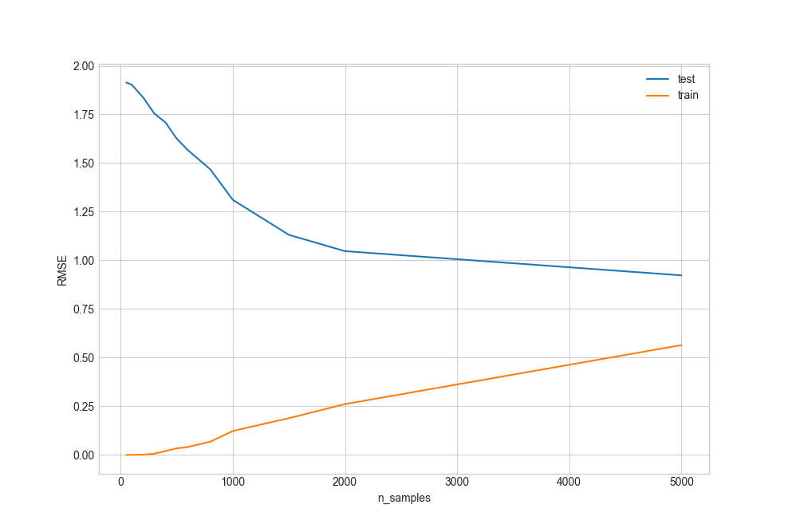
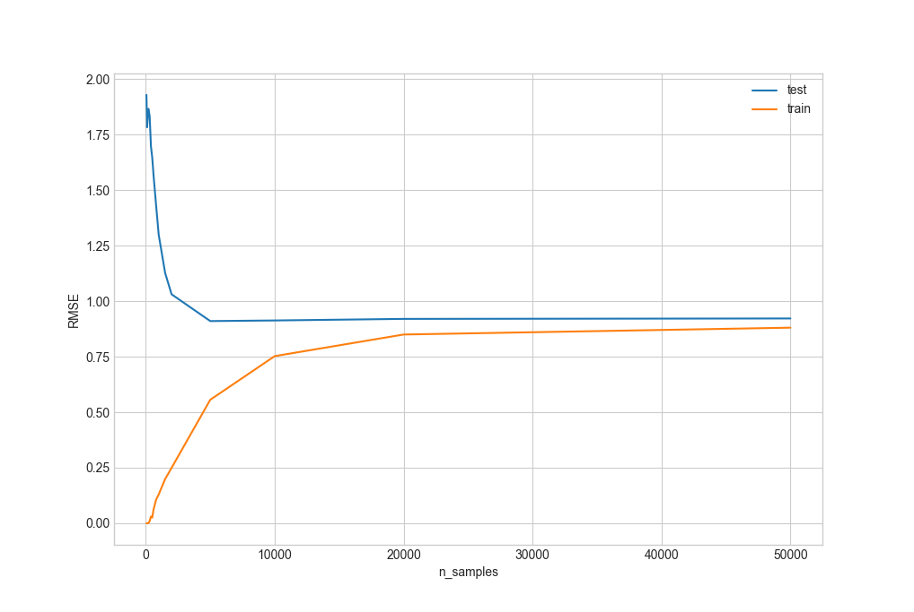
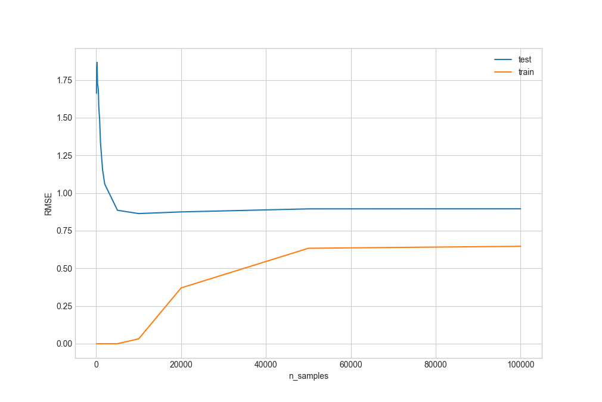
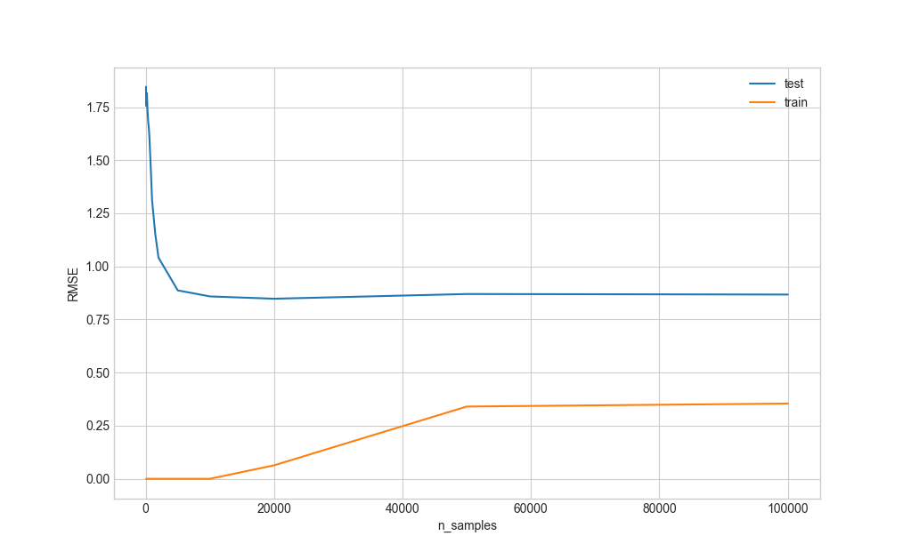
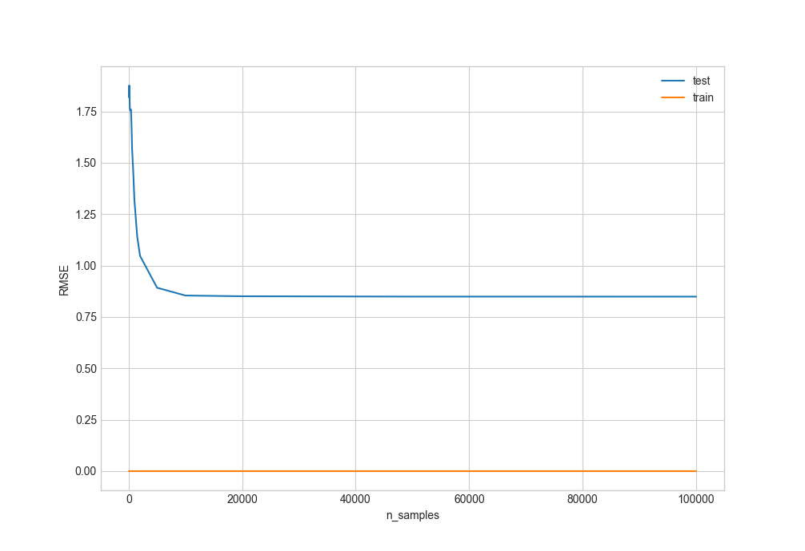
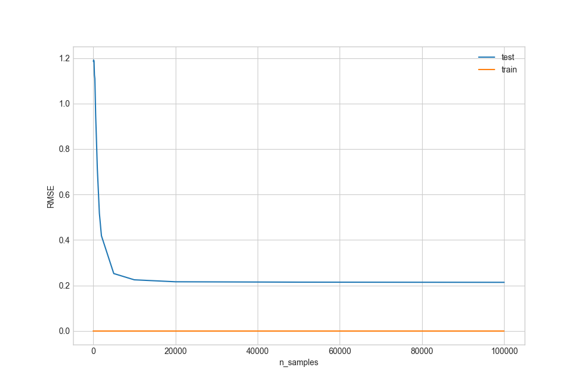
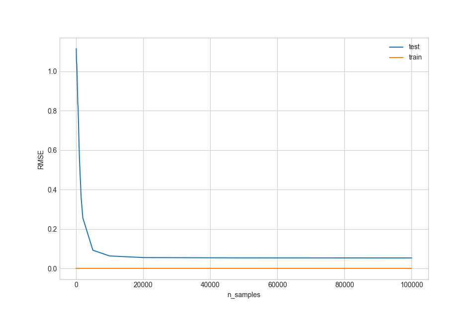
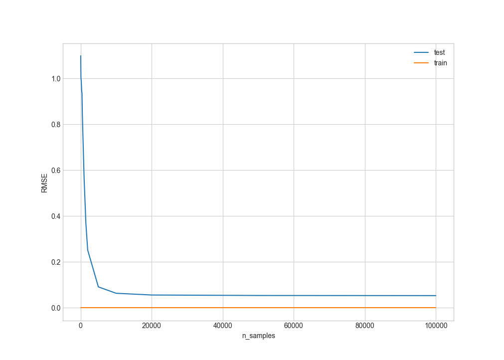
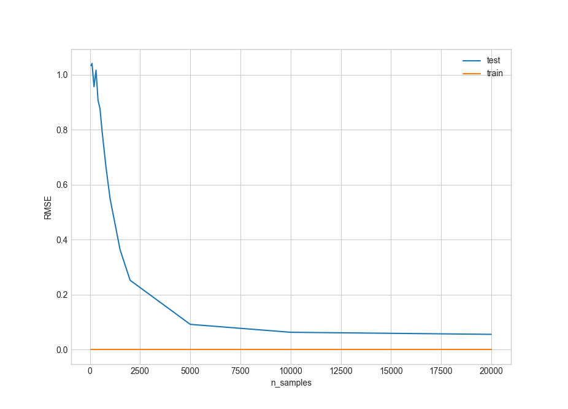
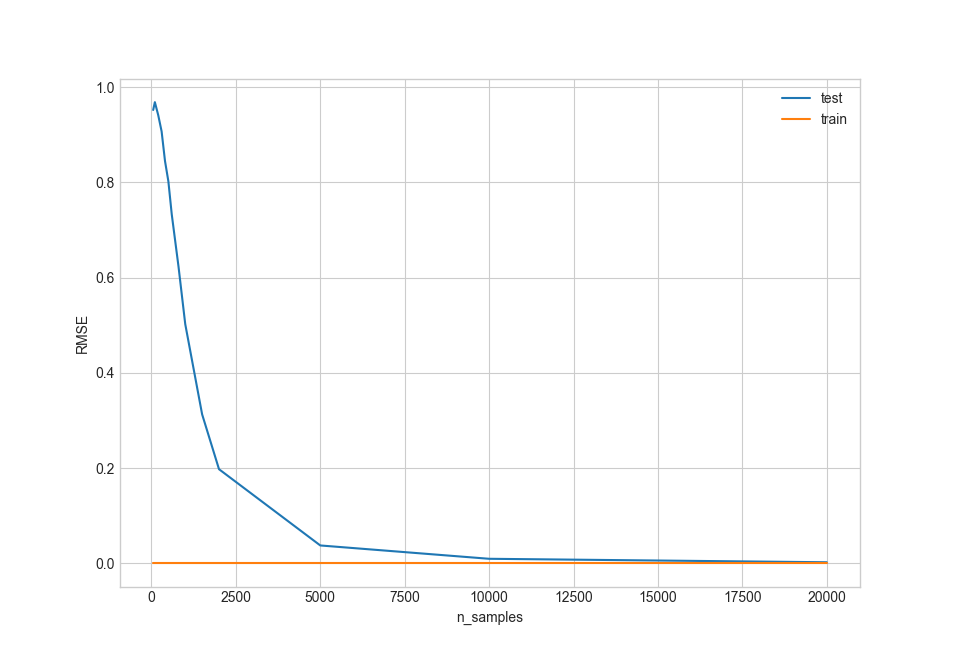

# Lerning Curves in mashine learing

## Opis

    Użyty model: DecisionTreeRegressor z sklearn


## Dane o dużym poziomme szumu, złe parametry modelu, mało danych



## Dodawanie danych
    Dodano więcej danych



## Optumalizacja modelu
### Dane o dużym poziomme szumu, złe parametry modelu
    Zwiększono parametr max_deph do 100

    Zwiększono parametr max_deph do 200

    Zwiększono parametr max_deph do 400



## Optumalizacja danych (odszumianie)
### Dane o dużym poziomme szumu
    Zredukowano szum w danych z 320% na 160%


    Zredukowano szum w danych z 160% na 80%

``` 
    test        train   n_samples
0   1.114913    0.0       50.0
1   1.052566    0.0      100.0
2   1.035623    0.0      200.0
3   0.983869    0.0      300.0
4   0.909814    0.0      400.0
5   0.837584    0.0      500.0
6   0.816526    0.0      600.0
7   0.676125    0.0      800.0
8   0.553506    0.0     1000.0
9   0.361300    0.0     1500.0
10  0.256772    0.0     2000.0
11  0.092612    0.0     5000.0
12  0.063459    0.0    10000.0
13  0.055396    0.0    20000.0
14  0.053650    0.0    50000.0
15  0.053403    0.0    99999.0
```
    Zredukowano szum w danych z 80% na 40%

``` 
    test        train   n_samples
0   1.098140    0.0       50.0
1   1.002978    0.0      100.0
2   0.986262    0.0      200.0
3   0.948221    0.0      300.0
4   0.935530    0.0      400.0
5   0.842864    0.0      500.0
6   0.786112    0.0      600.0
7   0.671617    0.0      800.0
8   0.561602    0.0     1000.0
9   0.366425    0.0     1500.0
10  0.251762    0.0     2000.0
11  0.091215    0.0     5000.0
12  0.063333    0.0    10000.0
13  0.055790    0.0    20000.0
14  0.053647    0.0    50000.0
15  0.053080    0.0    99999.0
```


## Dostosowanie ilości danych
Zmniejszono ilość danych do 20000

``` 
    test        train   n_samples
0   1.033674    0.0       50.0
1   1.041872    0.0      100.0
2   0.957186    0.0      200.0
3   1.017101    0.0      300.0
4   0.907415    0.0      400.0
5   0.876414    0.0      500.0
6   0.796462    0.0      600.0
7   0.662311    0.0      800.0
8   0.550007    0.0     1000.0
9   0.363577    0.0     1500.0
10  0.252667    0.0     2000.0
11  0.092168    0.0     5000.0
12  0.063374    0.0    10000.0
13  0.055850    0.0    20000.0
```

## <span style="color: #6c5">Optymalny model i idealne dane

``` 
    test        train   n_samples
0   0.952011    0.0       50.0
1   0.968471    0.0      100.0
2   0.940994    0.0      200.0
3   0.906987    0.0      300.0
4   0.844940    0.0      400.0
5   0.802214    0.0      500.0
6   0.732953    0.0      600.0
7   0.623437    0.0      800.0
8   0.502350    0.0     1000.0
9   0.312965    0.0     1500.0
10  0.197828    0.0     2000.0
11  0.037767    0.0     5000.0
12  0.009781    0.0    10000.0
13  0.002489    0.0    20000.0
```